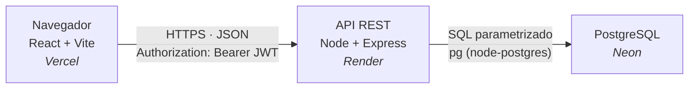

# Récord de Catedráticos — ECYS FIUSAC

**Manual Técnico**

Aplicación web donde los estudiantes de la Escuela de Ciencias y Sistemas publican su experiencia
sobre los cursos y catedráticos de la carrera, votan y comentan en hilos anidados, y administran su
propia red de estudios.

Proyecto de **Prácticas Iniciales**, 2do semestre 2026, Sección F — Ing. Herman Véliz.

|                   |                                               |
| ----------------- | --------------------------------------------- |
| **Frontend**      | https://frontend-seven-inky-29.vercel.app     |
| **API**           | https://record-catedraticos-ecys.onrender.com |
| **Base de datos** | PostgreSQL en Neon (privada)                  |

> **Nota para evaluar la app:** el backend corre en el plan gratuito de Render, que **suspende el
> servicio tras ~15 minutos sin tráfico**. La primera petición después de un rato de inactividad
> puede tardar **30-50 segundos** mientras el servicio arranca. Las siguientes son inmediatas.

---

## Índice

1. [Arquitectura](#1-arquitectura)
2. [Stack tecnológico y justificación](#2-stack-tecnológico-y-justificación)
3. [Estructura del repositorio](#3-estructura-del-repositorio)
4. [Base de datos](#4-base-de-datos)
5. [Funciones del servidor](#5-funciones-del-servidor)
6. [Autenticación y seguridad](#6-autenticación-y-seguridad)
7. [Frontend](#7-frontend)
8. [Ejecución local](#8-ejecución-local)
9. [Despliegue](#9-despliegue)
10. [Decisiones de diseño](#10-decisiones-de-diseño)
11. [Trabajo futuro](#11-trabajo-futuro)

---

## 1. Arquitectura

La aplicación es cliente-servidor de tres capas, cada una desplegada en un servicio distinto:



**El frontend no habla nunca con la base de datos.** Toda lectura y escritura pasa por la API, que es
el único punto donde se valida quién hace la petición y qué tiene permitido hacer. El navegador solo
guarda un token de sesión.

Las tres capas están completamente separadas: se puede reemplazar el frontend sin tocar el backend, o
mover la base de datos a otro proveedor cambiando una sola variable de entorno.

---

## 2. Stack tecnológico y justificación

| Capa           | Tecnología                            | Por qué                                                                                                                                                                                                                                         |
| -------------- | ------------------------------------- | ----------------------------------------------------------------------------------------------------------------------------------------------------------------------------------------------------------------------------------------------- |
| Base de datos  | **PostgreSQL** (Neon)                 | El modelo es fuertemente relacional: cursos con prerrequisitos, comentarios anidados, votos únicos por usuario. Todo eso se expresa con claves foráneas y restricciones que la base misma hace cumplir. Neon ofrece un plan gratuito permanente |
| Acceso a datos | **`pg` (node-postgres)**, sin ORM     | Se escribe SQL directo. Un ORM habría ocultado justamente lo que este curso evalúa: las consultas, los `JOIN`, las transacciones. Además, consultas como el árbol recursivo de comentarios son incómodas de expresar en un ORM                  |
| Backend        | **Node.js + Express 4**               | Mismo lenguaje que el frontend (un solo idioma mental para todo el proyecto). Express es mínimo y explícito: cada middleware y cada ruta están escritos a mano, no generados                                                                    |
| Autenticación  | **JWT** (`jsonwebtoken`) + **bcrypt** | El token permite que el servidor no guarde sesiones en memoria, lo cual importa en Render porque el servicio se reinicia al despertar y perdería cualquier sesión almacenada en el proceso                                                      |
| Frontend       | **React 19 + Vite**                   | React por componentes reutilizables y estado declarativo. Vite por el arranque instantáneo en desarrollo y el empaquetado optimizado en producción                                                                                              |
| Enrutado       | **React Router 7**                    | Navegación del lado del cliente: cambiar de pantalla no recarga la página                                                                                                                                                                       |
| Íconos         | **lucide-react**                      | Set consistente de íconos de trazo, importados uno por uno (solo entra al bundle lo que se usa)                                                                                                                                                 |
| Estilos        | **CSS plano con variables**           | Sin framework de CSS. Los colores, espaciados y tipografías viven como _custom properties_ en un solo archivo (`tokens.css`)                                                                                                                    |
| Linter         | **oxlint**                            | Rápido, sin configuración pesada                                                                                                                                                                                                                |

### Lo que deliberadamente **no** se usó

- **Sin ORM** (Prisma, Sequelize, TypeORM) — ver arriba.
- **Sin herramienta de migraciones** — los cambios de esquema son archivos `.sql` numerados que se
  ejecutan en orden. Para un proyecto de este tamaño, una herramienta de migraciones agrega más
  conceptos que valor.
- **Sin Docker** — los tres servicios (Neon, Render, Vercel) se despliegan desde el repositorio
  directamente. No hay nada que contenerizar.
- **Sin librería de componentes** (Material UI, Bootstrap) — el diseño de alta fidelidad ya existía y
  reproducirlo con una librería habría significado pelear contra sus estilos por defecto.

---

## 3. Estructura del repositorio

Monorepo con las tres partes separadas por carpeta:

```
.
├── db/                        Esquema y datos iniciales (SQL)
│   ├── 001_schema.sql         Tipos ENUM, tablas, índices
│   ├── 002_seed_courses.sql   Los 75 cursos del pensum y sus 123 prerrequisitos
│   ├── 003_seed_professors.sql  44 catedráticos y 61 auxiliares reales
│   ├── 004_seed_demo.sql      Estudiantes, publicaciones y comentarios de ejemplo
│   └── schema.dbml            Fuente del diagrama (dbdiagram.io)
│
├── backend/                   API REST (Node + Express)
│   ├── .env.example           Variables de entorno necesarias
│   └── src/
│       ├── server.js          Arranca el servidor HTTP
│       ├── app.js             Middlewares globales y montaje de routers
│       ├── db.js              Pool de conexiones de PostgreSQL
│       ├── lib/
│       │   ├── asyncHandler.js  Captura errores de funciones async
│       │   └── curriculum.js    Consulta compartida de la red de estudios
│       ├── middleware/
│       │   └── auth.js          Verificación del JWT
│       └── routes/              Un archivo por recurso
│
├── frontend/                  Aplicación React (Vite)
│   ├── vercel.json            Reescritura de rutas para el enrutado del cliente
│   └── src/
│       ├── main.jsx  App.jsx    Punto de entrada y definición de rutas
│       ├── api/client.js        Cliente HTTP con el token de sesión
│       ├── context/             Estado de sesión global
│       ├── routes/              Guardia de rutas protegidas
│       ├── components/          Componentes agrupados por dominio
│       ├── pages/               Una carpeta por tipo de pantalla
│       └── styles/              Tokens de diseño y estilos compartidos
│
└── design_handoff_record_catedraticos/   Diseño de alta fidelidad de referencia
```

**Convención de nombres.** Todo identificador de código —tablas, columnas, variables, funciones,
archivos y rutas de la API— está en **inglés**. El español queda reservado para lo que es _dato_: los
nombres de cursos y catedráticos, el texto de la interfaz, y los valores de los `ENUM` (`'aprobado'`,
`'cursando'`, `'pendiente'`), que viajan tal cual al frontend.

---

## 4. Base de datos


### Tipos enumerados

```sql
CREATE TYPE professor_role AS ENUM ('catedratico', 'auxiliar');
CREATE TYPE course_area    AS ENUM ('metodologia', 'desarrollo', 'ciencias');
CREATE TYPE course_status  AS ENUM ('aprobado', 'cursando', 'pendiente');
```

### Tablas

| Tabla                                | Contenido                                | Notas                                                                                                                                                                                                                                                          |
| ------------------------------------ | ---------------------------------------- | -------------------------------------------------------------------------------------------------------------------------------------------------------------------------------------------------------------------------------------------------------------- |
| **`student`**                        | Los usuarios de la aplicación            | `academic_registration` y `dpi` tienen restricciones `CHECK` con expresión regular (`^\d{4}-\d{5}$` y `^\d{13}$`). Los dos son únicos, y cualquiera de los dos sirve para iniciar sesión                                                                       |
| **`professor`**                      | Catedráticos y auxiliares                | No tienen cuenta propia: no usan la app, los estudiantes escriben _sobre_ ellos. La columna `academic_role` distingue los dos roles en una sola tabla                                                                                                          |
| **`course`**                         | Los 75 cursos del pensum                 | La clave primaria es el `code` (`char(4)`): los códigos del pensum son permanentes y nunca se reasignan, así que no hace falta un id artificial. `credits` y `area` admiten `NULL` (las prácticas no dan créditos; algunos cursos no pertenecen a ningún área) |
| **`course_prerequisite`**            | Qué cursos hay que aprobar antes de cuál | Relación muchos-a-muchos de `course` **consigo misma**. El `CHECK (course_code <> prerequisite_code)` impide que un curso sea prerrequisito de sí mismo                                                                                                        |
| **`course_professor`**               | Qué catedrático ha impartido qué curso   | Es lo que alimenta el desplegable de catedráticos al crear una publicación, una vez elegido el curso                                                                                                                                                           |
| **`post`**                           | Las publicaciones                        | `course_code` es obligatorio y `professor_id` opcional: se puede escribir sobre un curso sin señalar a nadie. Tiene índices en `created_at DESC` (el feed ordena por fecha), `course_code` y `professor_id` (los filtros)                                      |
| **`comment`**                        | Los comentarios                          | `parent_comment_id` es autorreferente y opcional: `NULL` = comentario de primer nivel; con valor = respuesta a otro comentario. Eso es lo que permite anidar hilos sin límite de profundidad                                                                   |
| **`post_vote`** / **`comment_vote`** | Los votos                                | Clave primaria compuesta `(student_id, target_id)`: **la base misma garantiza un voto por persona**. `value` solo admite `1` o `-1`                                                                                                                            |
| **`student_course_status`**          | La red de estudios de cada quien         | Clave primaria compuesta `(student_id, course_code)`                                                                                                                                                                                                           |

### Dos decisiones del modelo que vale la pena explicar

**1. Dos tablas de votos en vez de una tabla polimórfica.**
Lo intuitivo sería una sola tabla `vote` con columnas `target_type` ('post' / 'comment') y `target_id`.
El problema es que **PostgreSQL no puede poner una clave foránea que apunte a dos tablas distintas
según el valor de otra columna**. Con una tabla polimórfica, la integridad referencial habría quedado
en manos del código de la aplicación: nada impediría un voto huérfano apuntando a un post borrado. Con
dos tablas, cada una tiene su `REFERENCES ... ON DELETE CASCADE` real y **la base limpia sola** los
votos cuando se borra el objeto votado.

**2. La ausencia de fila significa `'pendiente'`.**
En `student_course_status`, un curso sin fila se considera pendiente. Marcar un curso como
`'pendiente'` **borra la fila** en vez de guardarla. Así, el tamaño de la tabla es proporcional al
avance real de cada estudiante y no al tamaño completo del pensum multiplicado por la cantidad de
usuarios. Las consultas usan `COALESCE(scs.status, 'pendiente')` para reconstruir el valor.

### Créditos aprobados: derivados, nunca almacenados

El total de créditos **no se guarda en ninguna columna**. Se calcula al momento:

```sql
SELECT coalesce(sum(c.credits) FILTER (WHERE scs.status = 'aprobado'), 0)
FROM student st
LEFT JOIN student_course_status scs ON scs.student_id = st.id
LEFT JOIN course c ON c.code = scs.course_code
WHERE st.id = $1
GROUP BY st.id;
```

Guardarlo habría creado dos fuentes de verdad que pueden contradecirse: si un `UPDATE` fallara a medias,
el total diría una cosa y la malla otra. Derivándolo, **es imposible que estén desincronizados**.

### Carga inicial

Los cuatro archivos de `db/` se ejecutan **en orden** en el editor SQL de Neon. El orden importa: una
tabla no puede referenciar por clave foránea a otra que todavía no existe.

Los datos de `002` y `003` son **reales**: el pensum completo de ECYS con sus prerrequisitos verificados
contra la imagen oficial de la red de estudios, y los catedráticos y auxiliares del horario publicado
para el segundo semestre 2026.

---

## 5. Funciones del servidor

API REST sobre HTTPS. Todo el intercambio es JSON. Las rutas marcadas con 🔒 exigen la cabecera
`Authorization: Bearer <token>`; sin ella responden `401`.

### Resumen

| Método  | Ruta                          | Auth | Función                                         |
| ------- | ----------------------------- | :--: | ----------------------------------------------- |
| `GET`   | `/health`                     |      | Verifica que el servicio esté vivo              |
| `POST`  | `/auth/register`              |      | Crea una cuenta y devuelve el token             |
| `POST`  | `/auth/login`                 |      | Valida credenciales y devuelve el token         |
| `GET`   | `/courses`                    |      | Pensum completo con prerrequisitos              |
| `GET`   | `/professors`                 |      | Catedráticos, opcionalmente filtrados por curso |
| `GET`   | `/posts`                      |  🔒  | Feed de publicaciones, con filtros              |
| `GET`   | `/posts/:id`                  |  🔒  | Una publicación                                 |
| `POST`  | `/posts`                      |  🔒  | Crea una publicación                            |
| `GET`   | `/posts/:id/comments`         |  🔒  | Árbol completo de comentarios                   |
| `POST`  | `/posts/:id/comments`         |  🔒  | Crea comentario o respuesta                     |
| `POST`  | `/votes/posts/:id`            |  🔒  | Vota una publicación (alterna)                  |
| `POST`  | `/votes/comments/:id`         |  🔒  | Vota un comentario (alterna)                    |
| `GET`   | `/profile`                    |  🔒  | Datos propios y créditos aprobados              |
| `PATCH` | `/profile`                    |  🔒  | Cambia correo o contraseña                      |
| `GET`   | `/profile/courses`            |  🔒  | Red de estudios propia                          |
| `PUT`   | `/profile/courses/:code`      |  🔒  | Cambia el estado de un curso                    |
| `GET`   | `/students/:registro`         |  🔒  | Perfil público de otro estudiante               |
| `GET`   | `/students/:registro/courses` |  🔒  | Red de estudios de otro estudiante              |

### Autenticación

#### `POST /auth/register`

Crea un estudiante. Recibe `academicRegistration`, `dpi`, `firstName`, `lastName`, `email`, `password`.

Antes de insertar, **cifra la contraseña con bcrypt** (10 rondas de sal). La contraseña en claro nunca
se guarda ni se registra en ningún log. Devuelve `201` con los datos del estudiante y un token recién
firmado, de forma que el registro deja la sesión ya iniciada.

Responde `400` si falta algún campo y `409` si el registro académico, el DPI o el correo ya existen
(detectado por el código de error `23505` de PostgreSQL, que corresponde a violación de restricción
única — no se consulta antes para preguntar si existe, porque entre la consulta y la inserción otro
proceso podría haber insertado el mismo valor).

#### `POST /auth/login`

Recibe `identifier` y `password`. El `identifier` se compara contra **dos columnas a la vez**
(`WHERE academic_registration = $1 OR dpi = $1`), que es lo que permite iniciar sesión con cualquiera
de los dos.

Compara la contraseña con `bcrypt.compare`, que vuelve a cifrar la contraseña recibida con la misma
sal almacenada y compara los resultados — el hash guardado **no se puede revertir**.

Responde `401` con **el mismo mensaje genérico** (`"Credenciales inválidas."`) tanto si el usuario no
existe como si la contraseña es incorrecta. Distinguir los dos casos le diría a un atacante qué
registros académicos están dados de alta.

### Catálogos

#### `GET /courses`

Devuelve los 75 cursos con su nombre, créditos, área, semestre, si es obligatorio, y **el arreglo de
sus prerrequisitos**. Los prerrequisitos se agregan en la misma consulta:

```sql
coalesce(
  json_agg(cp.prerequisite_code) FILTER (WHERE cp.prerequisite_code IS NOT NULL),
  '[]'
) AS prerequisites
```

El `FILTER` evita que un curso sin prerrequisitos devuelva `[null]` (efecto del `LEFT JOIN`), y el
`COALESCE` lo convierte en un arreglo vacío. Así el frontend siempre recibe un arreglo y nunca tiene
que comprobar si es nulo.

#### `GET /professors`

Con el parámetro opcional `?courseCode=0964` devuelve solo los que han impartido ese curso, uniendo
contra `course_professor`. Sin el parámetro, devuelve todos. Ordena por `academic_role` primero, para
que catedráticos y auxiliares salgan agrupados.

### Publicaciones

#### `GET /posts` — el endpoint más pesado

Devuelve el feed con todo lo que la tarjeta necesita: autor, curso con su área, catedrático, puntaje,
cantidad de comentarios, y **el voto del usuario que consulta** (para pintar su flecha en naranja).
Todo en **una sola consulta**, sin peticiones adicionales por publicación.

Las dos técnicas que lo hacen posible:

```sql
LEFT JOIN LATERAL (
  SELECT (SELECT sum(value) FROM post_vote WHERE post_id = p.id) AS score,
         (SELECT count(*)   FROM comment   WHERE post_id = p.id) AS comment_count
) stats ON true
```

`LATERAL` permite que una subconsulta del `FROM` **referencie columnas de las filas anteriores**
(`p.id`), que es justo lo que un `JOIN` normal no deja hacer. Es lo que permite calcular agregados por
fila sin agrupar toda la consulta.

```sql
WHERE ($2::char(4) IS NULL OR p.course_code = $2)
  AND ($3::int    IS NULL OR p.professor_id = $3)
  AND ($4::int    IS NULL OR p.student_id   = $4)
```

Este es el idioma de **filtro opcional**: si el parámetro llega nulo, la condición es verdadera para
todas las filas y el filtro desaparece. Evita construir el SQL concatenando texto según qué filtros
vengan, que es exactamente por donde entran las inyecciones SQL.

Acepta `?courseCode=`, `?professorId=` y `?studentId=`. Ordena por `created_at DESC`.

#### `GET /posts/:id`

La misma consulta acotada a una publicación. Responde `404` si no existe.

#### `POST /posts`

Recibe `courseCode`, `professorId` (opcional), `title`, `content`. Responde `400` si falta algo
obligatorio.

**El autor se toma de `req.student.id`, es decir del token — nunca del cuerpo de la petición.** Si se
aceptara un id del cliente, cualquiera podría publicar en nombre de otro.

### Comentarios

#### `GET /posts/:id/comments` — consulta recursiva

Los comentarios anidan sin límite de profundidad. Traerlos con consultas sucesivas (una por nivel)
sería lento e impredecible. En su lugar, una sola **consulta recursiva**:

```sql
WITH RECURSIVE comment_tree AS (
    -- Caso base: los comentarios de primer nivel
    SELECT id, post_id, student_id, parent_comment_id, content, created_at, 0 AS depth
    FROM comment
    WHERE post_id = $1 AND parent_comment_id IS NULL

    UNION ALL

    -- Paso recursivo: los hijos de lo ya encontrado, un nivel más abajo
    SELECT c.id, c.post_id, c.student_id, c.parent_comment_id, c.content, c.created_at, ct.depth + 1
    FROM comment c
    JOIN comment_tree ct ON c.parent_comment_id = ct.id
)
SELECT ... FROM comment_tree ct JOIN student st ON st.id = ct.student_id
ORDER BY ct.depth, ct.created_at;
```

`WITH RECURSIVE` tiene siempre esas dos mitades unidas por `UNION ALL`: un **caso base** que arranca la
búsqueda, y un **paso recursivo que se referencia a sí mismo** (`JOIN comment_tree`). PostgreSQL repite
el segundo hasta que deja de encontrar filas nuevas. La columna `depth` se calcula sumando uno en cada
vuelta.

Cada fila trae además su puntaje y el voto del usuario actual, con subconsultas escalares.

#### `POST /posts/:id/comments`

Recibe `content` y opcionalmente `parentCommentId`. Sin `parentCommentId` crea un comentario de primer
nivel; con él, una respuesta.

**Valida que el comentario padre pertenezca a esa misma publicación** antes de insertar. Sin esa
comprobación se podría responder desde la publicación 2 a un comentario de la publicación 1, dejando
un hilo imposible de mostrar.

### Votos

#### `POST /votes/posts/:id` y `POST /votes/comments/:id`

Reciben `value` (solo `1` o `-1`; cualquier otra cosa es `400`). El comportamiento es de **alternar**:

| Estado previo  | Acción           | Resultado              |
| -------------- | ---------------- | ---------------------- |
| Sin voto       | Se inserta       | El voto queda aplicado |
| Mismo voto     | Se borra la fila | El voto se retira      |
| Voto contrario | Se actualiza     | Cambia de sentido      |

Ambas rutas comparten la función `castVote`, que corre **dentro de una transacción**:

```js
await client.query("BEGIN");
// SELECT ... FOR UPDATE  → bloquea la fila del voto
// INSERT / DELETE / UPDATE según el caso
// SELECT sum(value)      → recalcula el puntaje
await client.query("COMMIT");
```

El `SELECT ... FOR UPDATE` **bloquea la fila** hasta que la transacción termina. Sin ese bloqueo, dos
clics rápidos podrían leer los dos el estado "sin voto" y ambos insertar, o el puntaje devuelto podría
corresponder a un momento intermedio. Si algo falla, el `ROLLBACK` deshace todo: nunca queda un voto
aplicado a medias.

Esta es también la única parte del proyecto que usa `pool.connect()` en lugar del pool directamente:
**una transacción necesita que todas sus consultas viajen por la misma conexión física**, y el pool
reparte conexiones distintas en cada llamada.

Devuelven `{ userVote, score }` con el estado ya recalculado, para que la interfaz no tenga que
recargar nada. Responden `404` si el objeto votado no existe (código `23503`, violación de clave
foránea).

### Perfil

#### `GET /profile`

Los datos del estudiante autenticado, incluidos `dpi`, `email` y `created_at` —que el perfil público
**no** expone— y el total de créditos aprobados calculado al momento.

#### `PATCH /profile`

Cambia el correo o la contraseña. **Exige `currentPassword` y la verifica con `bcrypt.compare` antes de
modificar nada**: `400` si no se envía, `401` si no coincide.

Esa re-autenticación es deliberada. Sin ella, una sesión abierta y olvidada en una computadora del
laboratorio le alcanzaría a cualquiera para cambiar la contraseña y dejar al dueño fuera de su propia
cuenta.

La consulta se arma dinámicamente según qué campos lleguen, pero **los valores siempre viajan
parametrizados**:

```js
if (email) {
  values.push(email);
  fields.push(`email = $${values.length}`);
}
```

Lo que se concatena es el nombre de la columna (que sale de código escrito a mano), nunca el dato.
Responde `409` si el correo nuevo ya pertenece a otro estudiante.

#### `GET /profile/courses`

El pensum completo con el estado propio de cada curso (`COALESCE(scs.status, 'pendiente')`) y sus
prerrequisitos. Es lo que dibuja la malla del perfil.

#### `PUT /profile/courses/:code`

Cambia el estado de un curso. Recibe `status`, que debe ser uno de los tres valores válidos (`400` si
no).

Dos caminos distintos:

- **`'pendiente'`** → **borra** la fila (ver la decisión del modelo en la sección 4).
- **`'aprobado'` / `'cursando'`** → inserta o actualiza en una sola instrucción:

```sql
INSERT INTO student_course_status (student_id, course_code, status)
VALUES ($1, $2, $3)
ON CONFLICT (student_id, course_code) DO UPDATE SET status = excluded.status;
```

Ese `ON CONFLICT ... DO UPDATE` es un **upsert**: si la fila ya existe, en vez de fallar por clave
duplicada, la actualiza. `excluded` es la fila que se intentó insertar. Evita tener que consultar
primero si existe, con la carrera que eso implicaría.

### Otros estudiantes

#### `GET /students/:academicRegistration`

Perfil público: nombre, registro académico, créditos aprobados y cantidad de publicaciones y
comentarios.

**Omite deliberadamente `dpi`, `email` y `created_at`.** El DPI es un dato de identidad personal y el
correo permite contactar a alguien fuera de la aplicación; ninguno de los dos hace falta para ver el
avance académico de un compañero. La selección de columnas es la frontera de privacidad, y está en la
consulta misma, no en un filtro posterior que se pueda olvidar.

#### `GET /students/:academicRegistration/courses`

La red de estudios de otro estudiante, en modo lectura. Busca primero al estudiante en una consulta
aparte para poder responder `404` de verdad: resolviéndolo todo junto, un registro académico
inexistente habría devuelto los 75 cursos en `'pendiente'` en lugar de un error.

### Middlewares globales

Definidos en `app.js`, en este orden:

1. **CORS** — controla desde qué orígenes acepta peticiones el navegador (ver sección 6).
2. **`express.json()`** — convierte el cuerpo JSON de la petición en `req.body`. Sin esto, `req.body`
   llega vacío.
3. **Los routers**, montados por prefijo.
4. **Manejador de errores** — Express lo reconoce porque tiene **cuatro parámetros**
   (`err, req, res, next`); ésa es la firma que lo distingue de un middleware normal. Registra el error
   en el log del servidor y responde un `500` genérico, sin filtrar detalles internos al cliente.

Todas las rutas asíncronas van envueltas en `asyncHandler`:

```js
export function asyncHandler(fn) {
  return (req, res, next) => {
    Promise.resolve(fn(req, res, next)).catch(next);
  };
}
```

**Express 4 no captura los errores lanzados dentro de funciones `async`.** Sin esta envoltura, un fallo
de base de datos dejaría la petición colgada hasta que el navegador se rindiera, sin ninguna respuesta
ni rastro en los logs. `asyncHandler` atrapa el rechazo de la promesa y lo pasa a `next()`, que es lo
que lleva el error al manejador global.

---

## 6. Autenticación y seguridad

### Contraseñas

Se almacenan como hash **bcrypt con 10 rondas de sal**. bcrypt es deliberadamente lento (ahí está su
valor: hace inviable probar millones de contraseñas por segundo) e incorpora una sal aleatoria distinta
por usuario, de modo que dos personas con la misma contraseña tienen hashes distintos. **El hash no se
puede revertir**: para verificar, se vuelve a cifrar lo que el usuario escribió y se comparan.

### Tokens de sesión (JWT)

Al iniciar sesión, el servidor firma un token con tres partes: `header.payload.signature`.

El _payload_ contiene `sub` (el id del estudiante) y una expiración de **7 días**. Va codificado en
base64, que **no es cifrado**: cualquiera puede leerlo. Por eso el token no lleva nunca datos sensibles.

Lo que protege el secreto (`JWT_SECRET`) es la **firma**. Si alguien modifica el payload para decir que
es otro usuario, la firma deja de corresponder y `jwt.verify` lo rechaza. Sin el secreto no se puede
producir una firma válida.

El middleware `requireAuth` extrae el token de `Authorization: Bearer <token>`, lo verifica y deja
`req.student = { id: payload.sub }` disponible para la ruta. **El id del usuario siempre sale de ahí**,
nunca del cuerpo o de la URL.

En el navegador el token se guarda en `localStorage` si se marcó "Recordarme" (sobrevive al cierre) o
en `sessionStorage` si no (muere con la pestaña).

### Inyección SQL

**Toda consulta va parametrizada** con marcadores `$1`, `$2`. El valor viaja separado del texto de la
consulta y PostgreSQL nunca lo interpreta como código:

```js
query("select ... where academic_registration = $1 or dpi = $1", [identifier]);
```

Los identificadores (nombres de tabla y columna) no se pueden parametrizar por diseño del protocolo.
En el único lugar donde se interpolan —`castVote`, que sirve a las dos tablas de votos— los valores
provienen de **constantes escritas a mano en el propio archivo**, jamás de la petición, y así está
documentado en el código.

### CORS

CORS es una regla que **aplica el navegador**: impide que una página servida desde un origen haga
peticiones a otro, salvo que el segundo lo autorice explícitamente.

La variable `CORS_ORIGIN` acepta varios orígenes separados por coma, y además se permite por expresión
regular cualquier `https://*.vercel.app`. Hizo falta porque **Vercel asigna tres URLs distintas a cada
proyecto** (producción, rama y una por despliegue), y para el navegador cada una es un origen diferente.

Es un compromiso consciente: `*.vercel.app` es más amplio que enumerar orígenes exactos. Se acepta
porque **CORS no es lo que protege los datos de esta aplicación** — cada endpoint sensible exige el JWT
en la cabecera, y ese token vive en el almacenamiento del dominio propio, donde ningún otro sitio puede
leerlo. CORS aquí evita ruido de terceros; el candado real es el token.

### Lo que la validación del cliente **no** hace

El frontend valida formatos y campos obligatorios antes de enviar, y el componente `RequireAuth`
redirige al login a quien no tenga sesión. **Nada de eso es una barrera de seguridad**: cualquiera
puede modificar el JavaScript del navegador o llamar la API directamente con `curl`.

La validación del cliente existe para dar respuesta inmediata y evitar viajes innecesarios a la red.
**La única validación que cuenta es la del servidor**, y por eso está duplicada en ambos lados.

---

## 7. Frontend

### Enrutado

`react-router-dom` con `BrowserRouter`. Las rutas protegidas se envuelven en `RequireAuth`:

| Ruta                              | Pantalla                                 | Protegida |
| --------------------------------- | ---------------------------------------- | :-------: |
| `/login`                          | Inicio de sesión                         |           |
| `/register`                       | Registro                                 |           |
| `/`                               | Feed principal con filtros               |    🔒     |
| `/posts/new`                      | Crear publicación                        |    🔒     |
| `/posts/:id`                      | Publicación con su hilo de comentarios   |    🔒     |
| `/profile`                        | Perfil propio y red de estudios editable |    🔒     |
| `/students/:academicRegistration` | Perfil de otro estudiante                |    🔒     |

`RequireAuth` es un **guardia de ruta**: mientras la sesión se está verificando muestra un estado de
carga, si no hay sesión redirige a `/login`, y si la hay renderiza la pantalla. Es el reflejo en el
cliente del middleware `requireAuth` del servidor, pero —como se explicó arriba— **no es una barrera de
seguridad**, solo evita que alguien sin sesión vea pantallas vacías.

### Estado de sesión

Un `SessionContext` (React Context) mantiene el estudiante autenticado disponible en toda la
aplicación, sin pasarlo de componente en componente. Expone `login`, `register`, `logout` y
`updateStudent`, y el hook `useSession()` da acceso desde cualquier componente.

Al arrancar, si hay un token guardado, pide `GET /profile` para rehidratar la sesión. Si el token
caducó, lo descarta.

### Cliente HTTP

`api/client.js` centraliza toda comunicación con el backend: adjunta la cabecera `Authorization` cuando
hay token, convierte la respuesta a JSON, y **convierte cualquier respuesta de error en una excepción**
con el mensaje que envió el servidor. Así cada pantalla maneja los errores con `try/catch` sin repetir
la comprobación de `response.ok`.

La URL base sale de `import.meta.env.VITE_API_URL`. El prefijo `VITE_` es obligatorio y funciona como
frontera de seguridad: **solo las variables con ese prefijo se incrustan en el bundle**, para que un
secreto del servidor no termine publicado por descuido en el JavaScript del navegador.

### Componentes

```
components/
├── layout/AppNavbar            Barra superior con búsqueda de estudiantes
├── feed/PostCard               Tarjeta de publicación, con sus votos
├── comments/
│   ├── CommentThread           Reconstruye el árbol y lo dibuja
│   └── CommentItem             Un comentario; se renderiza a sí mismo recursivamente
├── curriculum/
│   ├── CurriculumGrid          La malla completa: agrupa por semestre y controla el popover
│   ├── SemesterColumn          El marco de un semestre
│   ├── CourseTile              El recuadro de un curso
│   ├── StatusPopover           Menú de tres estados
│   └── CurriculumLegend        Leyenda de velos y áreas
└── ui/
    ├── SearchableSelect        Desplegable con búsqueda escrita
    └── Modal                   Diálogo genérico
```

Dos piezas merecen explicación:

**El árbol de comentarios se reconstruye en el cliente.** El servidor devuelve una lista **plana**
ordenada por nivel; dibujarla así mezclaría las respuestas de hilos distintos. `CommentThread` arma un
`Map` de `id → comentario` y mete cada uno en el arreglo `children` de su padre. Después `CommentItem`
**se invoca a sí mismo** para cada hijo, y la indentación se acumula sola en CSS.

**La malla se apaga con una sola prop.** `CurriculumGrid` recibe `courses` y, opcionalmente,
`onStatusChange`. Si esa función no llega, la cuadrícula es de solo lectura: no pasa `onClick`,
`CourseTile` se renderiza como `<div>` en vez de `<button>` y el `StatusPopover` nunca se monta. Es lo
que permite que el perfil propio y el ajeno usen exactamente el mismo componente.

### Estilos

CSS plano, sin framework. `styles/tokens.css` define como variables CSS todos los colores, espaciados,
radios, sombras y la tipografía (Lato, servida localmente). Cada componente tiene su archivo `.css`
junto al `.jsx`, y lo que comparten varias pantallas vive en `styles/` (`auth.css`, `profile.css`).

La interfaz es adaptable con tres puntos de quiebre: **560px** (formularios de dos columnas pasan a
una), **760px** (la barra lateral se vuelve horizontal) y **480px** (se ocultan las etiquetas de texto
de la barra superior).

---

## 8. Ejecución local

**Requisitos:** Node.js 20 o superior y una base de datos PostgreSQL (Neon o local).

### 1. Base de datos

Ejecutar en orden, en el editor SQL de Neon o con `psql`:

```
db/001_schema.sql
db/002_seed_courses.sql
db/003_seed_professors.sql
db/004_seed_demo.sql
```

### 2. Backend

```bash
cd backend
npm install
cp .env.example .env    # y completar los valores
npm run dev             # http://localhost:3000
```

Variables necesarias en `backend/.env`:

| Variable       | Descripción                                     |
| -------------- | ----------------------------------------------- |
| `DATABASE_URL` | Cadena de conexión de PostgreSQL                |
| `JWT_SECRET`   | Cadena larga y aleatoria para firmar los tokens |
| `PORT`         | Puerto local (por defecto 3000)                 |
| `CORS_ORIGIN`  | Orígenes permitidos, separados por coma         |

### 3. Frontend

```bash
cd frontend
npm install
cp .env.example .env    # VITE_API_URL=http://localhost:3000
npm run dev             # http://localhost:5173
```

> El puerto **5173** debe coincidir con lo que declare `CORS_ORIGIN` en el backend. Si Vite arranca en
> otro puerto porque el 5173 está ocupado, las peticiones se bloquearán por CORS.

Otros comandos: `npm run build` (compila a `dist/`), `npm run lint` (oxlint), `npm run preview` (sirve
lo compilado).

**Los archivos `.env` no se versionan** (están en `.gitignore`) porque contienen credenciales reales.
Los `.env.example` sí, para documentar qué variables hacen falta.

---

## 9. Despliegue

| Servicio   | Qué aloja   | Configuración                                                                                                                                                                                  |
| ---------- | ----------- | ---------------------------------------------------------------------------------------------------------------------------------------------------------------------------------------------- |
| **Neon**   | PostgreSQL  | Plan gratuito. Suspende el cómputo tras ~5 min de inactividad y despierta en ~1 s                                                                                                              |
| **Render** | La API      | Root Directory `backend`, build `npm install`, start `npm start`. Las variables se cargan en su panel: **no lee el `.env`**. Render inyecta `PORT`, por eso el servidor usa `process.env.PORT` |
| **Vercel** | El frontend | Root Directory `frontend`, preset Vite, salida `dist`. `VITE_API_URL` se define en su panel                                                                                                    |

Los tres se redespliegan solos con cada push a `master`.

**Sobre la suspensión.** Vercel sirve archivos estáticos desde un CDN y **nunca se duerme**. El que
suspende es Render: tras ~15 minutos sin tráfico, la primera petición tarda 30-50 segundos mientras el
servicio arranca de nuevo.

**`frontend/vercel.json`** reescribe todas las rutas hacia `/index.html`:

```json
{ "rewrites": [{ "source": "/(.*)", "destination": "/index.html" }] }
```

Es indispensable. El enrutado es del lado del cliente y solo existe un archivo HTML real; sin esta
reescritura, entrar directamente a `/posts/5` —justo lo que produce el botón "Compartir"— haría que el
servidor buscara un archivo en esa ruta y devolviera `404`. Con ella, se entrega siempre el mismo HTML
y React Router resuelve la ruta ya en el navegador.

---

## 10. Decisiones de diseño

El proyecto partió de un diseño de alta fidelidad ya aprobado
(`design_handoff_record_catedraticos/`). Se implementó fielmente, con **tres desviaciones conscientes**:

### 1. Desplegables con búsqueda en lugar de píldoras de filtro

El diseño proponía filtros que abrían una lista simple. Con **75 cursos** y más de cien catedráticos,
eso obliga a recorrer la lista con la vista y desplazarse hasta encontrar lo buscado.

Se reemplazaron por un **desplegable con búsqueda escrita**: al escribir "orga", la lista se reduce a
las coincidencias. La búsqueda es **insensible a tildes y mayúsculas** (se normaliza con
`normalize('NFD')` y se eliminan los diacríticos), de modo que "organizacion" encuentra "Organización".

El mismo componente (`SearchableSelect`) se usa en dos formas visuales: píldora en la barra de filtros
y campo de formulario al crear una publicación.

### 2. Los comentarios son una pantalla propia, no una expansión dentro de la tarjeta

El diseño mostraba el hilo desplegándose dentro de la tarjeta del feed. Se implementó como una ruta
propia, `/posts/:id`.

La razón es que **cada publicación necesita un enlace propio**: el botón "Compartir" copia una URL que
al abrirse debe llevar directamente a esa publicación con su hilo. Con el hilo desplegado dentro del
feed eso no sería posible.

### 3. Sin la marca circular sobre los cursos

El diseño ponía un círculo blanco con `✓` o `•` sobre el velo de color de cada curso marcado. Se quitó
por resultar visualmente más limpio: el verde y el azul se distinguen bien por sí solos. El estado
sigue apareciendo en el tooltip del curso.

---

## 11. Trabajo futuro

**Recuperación de contraseña.** El diseño incluye la pantalla, pero no se implementó: el flujo real
exige un servicio de envío de correo (SendGrid, Resend o similar), una tabla de tokens de un solo uso
con caducidad corta, y un endpoint que los valide. Ninguna de esas piezas cabía en el alcance ni en el
presupuesto —todos los servicios usados son de plan gratuito—. La decisión fue dejarlo fuera antes que
entregar una pantalla que no funciona.

**Paginación del feed.** `GET /posts` devuelve todas las publicaciones. Con el volumen actual no es un
problema, pero con miles de publicaciones haría falta paginar (`LIMIT`/`OFFSET`, o mejor por cursor
sobre `created_at`).

**Fotos de perfil.** Hoy el avatar es siempre una silueta. Subir imágenes exigiría almacenamiento de
archivos, que ninguno de los tres servicios gratuitos cubre bien.

**Edición y borrado de publicaciones.** Actualmente solo se pueden crear. El esquema ya lo soporta
(bastaría con `PATCH` y `DELETE` verificando que el autor coincida con el token).
